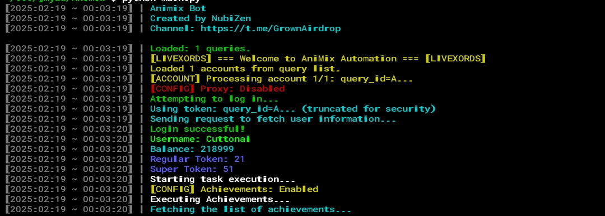

# Animix Telegram MiniApp Bot


This script automates various tasks for the Animix miniapp on Telegram.

## Features

The Animix Bot is designed to automate various tasks in **Animix**, including:

- **Automatic Gacha**  
- **Automatic Achievement Claims**  
- **Automatic DNA Mixing**  
- **Automatic Missions**  
- **Automatic Quests**  
- **Pass Reward Automation**  
- **PvP Automation**  
- **Multi-Account Support**  
- **Proxy Support**  

## ⚙️ Configuration in `config.json`

| **Function**           | **Description**                          | **Default** |
|------------------------|------------------------------------------|------------|
| `gacha`               | Automate gacha pulls                     | `True`     |
| `achievements`        | Claim achievements automatically         | `True`     |
| `mix`                 | Automate DNA mixing                      | `True`     |
| `mission`             | Complete missions automatically          | `True`     |
| `quest`               | Automate quest completion                | `True`     |
| `claim_pass`          | Claim pass rewards automatically         | `True`     |
| `pvp`                 | Engage in PvP battles automatically      | `True`     |
| `proxy`               | Enable/Disable proxy usage               | `False`    |
| `delay_loop`          | Delay before the next loop (seconds)     | `3000`     |
| `delay_account_switch`| Delay between account switches (seconds) | `10`       |

## Prerequisites

- Node.js installed on your machine  
- `users.txt` file containing user data. Follow the instructions below to obtain it:  
- Open Animix miniapp on Telegram: [https://t.me/animix_game_bot](https://t.me/animix_game_bot?startapp=OxVCDjJHE2Jk)  
- Inspect or press **F12**, then go to the **Application** tab  
- In session storage, find `tgWebAppData` and copy all values. `user=....`  

## Installation

1. Clone the repository:  
    ```sh
    git clone https://github.com/NubiZen/Animix.git
    cd Animix
    ```  

2. Install the required dependencies:  
    ```sh
    pip install requirements.txt
    ```  

3. Input your user data in `users.txt` (one user per line):  
    ```sh
    nano query.txt
    ```  

4. (Optional) Configure proxy support:  
   - Add your proxy in `proxy.txt` with the format: `http://username:password@ip:port`  
    ```sh
    nano proxy.txt
    ```  

5. Run the script:  
    ```sh
    python main.py
    ```  

## License  
  
This project is licensed under the [MIT License](LICENSE).